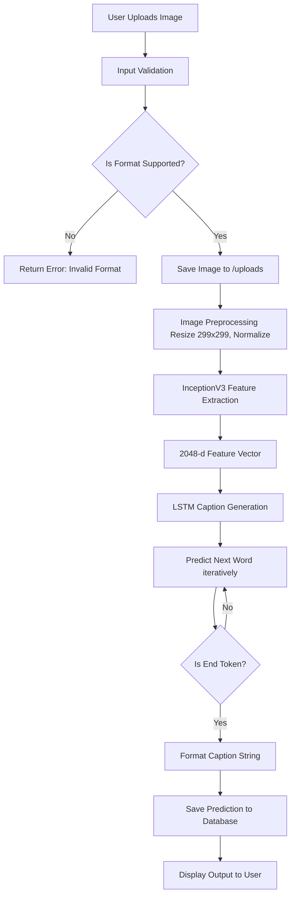
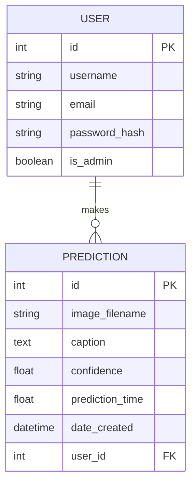
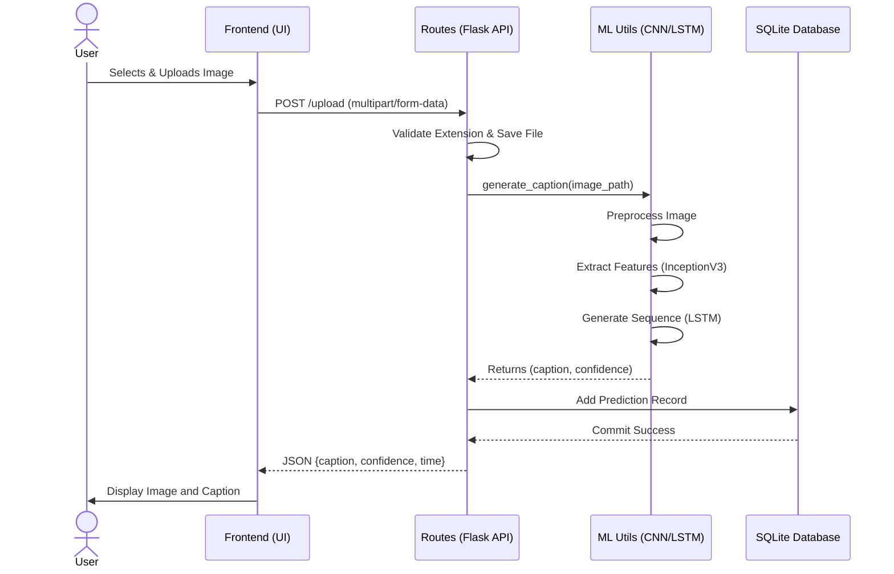
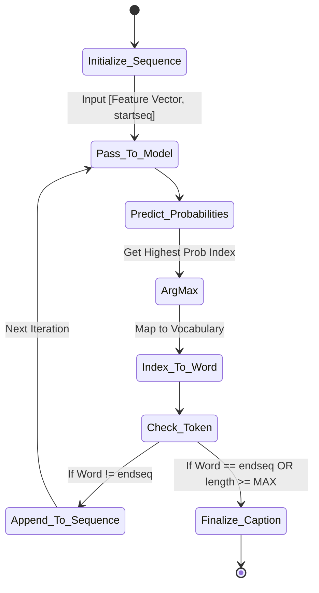

# System Architecture & UML Diagrams

This document contains all the UML and architectural diagrams for the "Image Captioning Using AI Technique" project, generated using Mermaid.js syntax.

## 1. Flowchart: System Workflow



## 2. Use Case Diagram

```mermaid
usecase
    actor User as "Registered User"
    actor Admin as "Administrator"
    
    package "Image Captioning System" {
        usecase UC1 as "Register / Login"
        usecase UC2 as "Upload Image"
        usecase UC3 as "View Generated Caption"
        usecase UC4 as "Listen to Caption (TTS)"
        usecase UC5 as "View Prediction History"
        usecase UC6 as "Export History to CSV"
        usecase UC7 as "View System Dashboard"
        usecase UC8 as "Manage Users & Logs"
    }
    
    User --> UC1
    User --> UC2
    User --> UC3
    User --> UC4
    User --> UC5
    User --> UC6
    User --> UC7
    
    Admin --> UC1
    Admin --> UC7
    Admin --> UC8
```

## 3. Database ER Diagram



## 4. Sequence Diagram: Image Upload & Prediction



## 5. Component Diagram

```mermaid
componentDiagram
    package "Frontend Layer" {
        [HTML/Jinja2 Templates]
        [Bootstrap 5 / CSS]
        [JavaScript / Fetch API]
    }
    
    package "Backend Layer (Flask)" {
        [Authentication Module]
        [Route Handlers]
        [Configuration Module]
    }
    
    package "Deep Learning Layer" {
        [CNN Extractor]
        [LSTM Generator]
        [Text Preprocessor]
    }
    
    package "Data Layer" {
        [SQLAlchemy ORM]
        [SQLite Database]
        [File System /uploads]
    }

    [JavaScript / Fetch API] --> [Route Handlers] : HTTP POST/GET
    [Route Handlers] --> [Authentication Module] : Verifies Session
    [Route Handlers] --> [CNN Extractor] : Passes Image
    [CNN Extractor] --> [LSTM Generator] : Passes Features
    [Route Handlers] --> [SQLAlchemy ORM] : Save History
    [SQLAlchemy ORM] --> [SQLite Database] : Read/Write
```

## 6. Activity Diagram: LSTM Generation Loop


